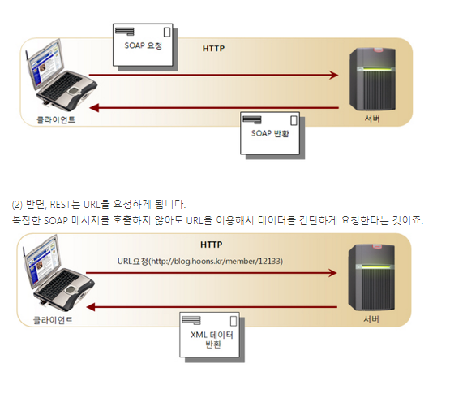

# REST

= Representational State Transfer
= 자원을 이름으로 구분하여 해당 자원의 상태를 주고 받는 모든 것
-> 자원의 표현(이름)에 의한 상태 전달

Rest는 네트워크 상에서 클라이언트와 서버 사이의 통신 방식중 하나

> Client는 URI를 이용해서 자원을 지정하고 해당 자원의 상태(정보)에 대한 조작을 Server에 요청함
> 자원이 있는 쪽이 Server, 자원을 요청하는 쪽이 Client

(여기에서 자원은 해당 소프트웨어가 관리하는 모든 것을 의미)

### 장점

- HTTP 프로토콜의 인프라를 그대로 사용하므로 REST API 사용을 위한 별도의 인프라를 구출할 필요가 없음
- HTTP 프로토콜의 표준을 최대한 활용하여 여러 추가적인 장점을 함께 가져갈 수 있게 해줌
- HTTP 표준 프로토콜에 따르는 모든 플랫폼에서 사용이 가능함
- Hypermedia API의 기본을 충실히 지키면서 범용성을 보장함
- REST API 메시지가 의도하는 바를 명확하게 나타내므로 의도하는 바를 쉽게 파악할 수 있음
- 여러가지 서비스 디자인에서 생길 수 있는 문제를 최소화함
- 서버와 클라이언트의 역할을 명확하게 분리함

### 단점

- 표준이 존재하지 않음
- 사용할 수 있는 메소드가 4가지 밖에 없음
- HTTP Method 형태가 제한적임
- 브라우저를 통해 테스트할 일이 많은 서비스라면 쉽게 고칠 수 있는 URL보다 Header 값이 왠지 더 어렵게 느껴짐
- 구형 브라우저가 아직 제대로 지원해주지 못하는 부분이 존재함
- PUT, DELETE를 사용하지 못하는 점
- pushState를 지원하지 않는 점

# REST API

=Rest란 형식의 Api

> API는 데이터와 기능의 집합을 제공하여 컴퓨터 프로그램간 상호작용을 촉진하며, 서로 정보를 교환가능 하도록 하는 것

정보들이 주고받아지는 데 있어서 개발자들 사이에 널리 쓰이는 형식
-> 프레임워크와 같은 종류에 상관없이 형식에 맞춰서 기능을 만들어내면 됨

> 최근 OpenAPI, 마이크로 서비스 등을 제공하는 업체 대부분은 REST API를 제공함

### 특징

- 사내 시스템들도 REST 기반으로 시스템을 분산해 확장성과 재사용성을 높여 유지보수 및 운용을 편리하게 할 수 있음
- REST는 HTTP 표준을 기반으로 구현하므로, HTTP를 지원하는 프로그램 언어로 클라이언트, 서버를 구현할 수 있음
- REST API를 제작하면 델파이 클라이언트 뿐 아니라, 자바, C#, 웹 등을 이용해 클라이언트를 제작할 수 있음

# RESTful

RESTful은 일반적으로 REST라는 아키텍처를 구현하는 웹 서비스를 나타내기 위해 사용되는 용어
(‘REST API’를 제공하는 웹 서비스를 ‘RESTful’하다고 할 수 있음)